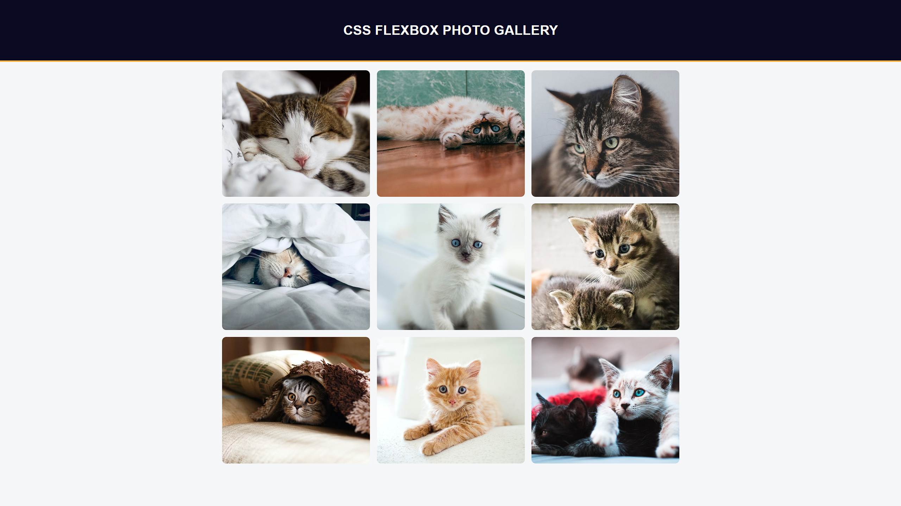

# Photo Gallery

A simple responsive photo gallery built using **HTML** and **CSS Flexbox**.

## Features

- Responsive layout using Flexbox  
- Neatly aligned and spaced images  
- Works on all screen sizes  
- Styled with a clean header and gallery section

## Preview

## How to Use

1. Download or clone the repository  
2. Open `index.html` in your browser  
3. Browse through the photo gallery

## Project Link

[Build a Photo Gallery - freeCodeCamp](https://www.freecodecamp.org/learn/2022/responsive-web-design/learn-css-flexbox-by-building-a-photo-gallery/step-1)
